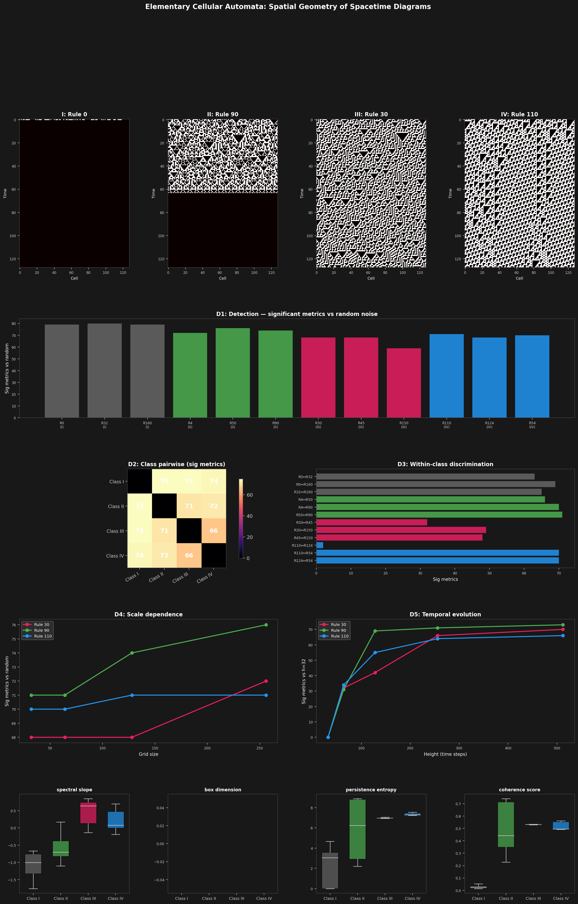

# Exotic Geometry Framework

Embed byte sequences into 31 exotic geometric spaces — E8 lattices, Heisenberg groups, tropical semirings, Penrose quasicrystals, and 8 native 2D spatial geometries — and measure what comes out. Structure that survives the embedding is real. Structure that doesn't is noise.

This framework treats data analysis as a question of **geometry**: different mathematical spaces are sensitive to different kinds of hidden structure. A single data stream analyzed through 24 independent 1D lenses produces a geometric fingerprint that can distinguish chaotic maps, detect cipher weaknesses, identify DNA organisms, and find backdoors in neural network weights. For 2D fields, 8 spatial geometries (80 metrics) span differential geometry, algebraic topology, conformal analysis, integral geometry, fractal scaling, Hodge theory, and spectral analysis.

**Key differentiator**: [Surrogate testing](#exotic-geometries-detect-nonlinear-structure-simple-features-cannot) proves these geometric embeddings capture genuinely nonlinear dynamical structure that no combination of entropy, autocorrelation, spectral slope, or other standard features can replicate. Simple features: **0 detections** against IAAFT surrogates. Exotic geometries: **204 detections** across 6 signal types.

## Headline Results

Every finding uses shuffled baselines, Bonferroni correction, and Cohen's d effect sizes. Zero false positives on validated random sources. See [docs/METHODOLOGY.md](docs/METHODOLOGY.md) for the full protocol.

### Hash functions are indistinguishable from random (methodology validation)

All 6 hash functions tested (MD5, SHA-1, SHA-256, SHA-3, BLAKE2, SHA-512) produce 0 significant geometric differences from `os.urandom`. This is the first result for a reason: it proves the framework doesn't hallucinate structure.

→ `investigations/1d/hashes.py`

### Exotic geometries detect nonlinear structure simple features cannot

Using IAAFT surrogates (Schreiber & Schmitz, 1996) — which preserve both power spectrum and marginal distribution by construction — we prove the framework captures genuinely nonlinear structure. Simple features (entropy, autocorrelation, spectral slope, permutation entropy, kurtosis, etc.) score **0/11 detections** against IAAFT surrogates for all 7 test signals. This is mathematically guaranteed: the surrogates match all linear statistics exactly.

Exotic geometries score **204 total detections** across 6 of 7 signals:

| Signal | Simple vs IAAFT | Exotic vs IAAFT |
|--------|:-:|:-:|
| Hénon map | 0 | 56 |
| Logistic map | 0 | 53 |
| Collatz stopping times | 0 | 42 |
| Heartbeat (ECG) | 0 | 30 |
| Lorenz attractor | 0 | 19 |
| Prime gaps | 0 | 4 |
| Coupled AR (linear) | 0 | 0 |

The coupled AR system correctly returns 0 — it's a linear system with no nonlinear structure to detect. Top nonlinear detectors: Higher-Order Statistics (37), E8 Lattice (27), Clifford Torus (23), Torus T² (22). Five geometries (2-adic, Cantor, Fisher, Heisenberg, Sol) score zero — they are linear-equivalent features in geometric clothing.

An [ablation study](#ablation-131-metrics--15-effective-dimensions) confirms this: exotic geometries amplify detection (79-89% of significant metrics) but 131 metrics collapse to ~15 independent dimensions. The surrogate test is what proves they carry genuinely new information.


→ `investigations/1d/surrogate.py` · `investigations/1d/ablation.py`

### ECB cipher mode detection (d = 19-146)

ECB mode leaks plaintext structure catastrophically. E8 root diversity drops from 72 (random) to 2 (ECB). All block ciphers in ECB mode produce identical geometric signatures. Stream ciphers and CTR/CBC modes are invisible.


→ `investigations/1d/ciphers.py` · `investigations/2d/ecb_penguin.py`

### Reduced-round AES: cliff at R=4

AES with 1 round: 40 metrics detect weakness. 2 rounds: 38 metrics. 3 rounds: 8 metrics. **4 rounds: 0 metrics.** The transition from detectable to indistinguishable is sharp, matching AES design theory (4 rounds = full diffusion).


→ `investigations/1d/reduced_aes.py`

### Advanced steganography detection

Six embedding techniques tested — from naive LSB replacement to Hamming-coded matrix embedding. PVD (pixel value differencing) is the most visible at 42 significant metrics on raw bytes. Spread spectrum: 25 sig. Matrix embedding (syndrome coding) is truly invisible to all geometries. Bitplane extraction does not improve detection — the 8x sample size reduction destroys statistical power. Delay embedding amplifies the signal for detectable techniques.

→ `investigations/1d/stego.py` · `investigations/1d/stego_deep.py`

### Chaotic map fingerprinting (45/45 pairwise)

10 chaotic maps (logistic, Henon, tent, Lorenz, Rossler, baker's, and more), all detected as non-random, all distinguishable from each other. Lorenz uniquely destroys Penrose 5-fold symmetry (d=60). Rossler shows extreme Tropical linearity (d=266).


→ `investigations/1d/chaos.py`

### Collatz sequences are massively non-random (7/7 encodings, 21/21 pairwise)

Seven encodings of Collatz (3n+1) dynamics — hailstone values, parity bits, stopping times, residues mod 7, high bits — all detected with 73-103 significant metrics. All 21 encoding pairs distinguished. Shuffle validation reveals hailstone structure is sequential (destroyed by shuffling) while parity is purely distributional. The 3n+1 and 5n+1 variants are geometrically distinguishable (71 metrics, d=12.8).


→ `investigations/1d/collatz.py`

### Deep Collatz: why does 3n+1 converge?

Two follow-up investigations probe the convergence mechanism of 3n+1 from ten angles.

**Phase transition (collatz_deep)** — The (2k+1)n+1 family shows a sharp phase boundary: 3n+1 (k=1) has 86 significant metrics vs random, while 5n+1 (k=2) drops to 35. Tropical odd-step slopes match theory exactly (μ=1.5855 vs log₂(3)=1.5850). Optimal delay embedding is at τ=2 (78 sig, monotonically decreasing). Bitplane signal is U-shaped (LSB=77, MSB=68).

**Convergence anatomy (collatz_deep2)** — Of ~131 metrics, **45 are convergence-specific** (significant for 3n+1, vanish for 5n+1), 41 are universal, and only 3 are divergence-specific. Five geometry families — Fisher Information, Heisenberg, Sol, Spherical, Wasserstein — are 100% convergence-aware: every one of their significant metrics goes dark at k=2. The Syracuse encoding of the v₂ (2-adic valuation) sequence is the richest representation at 105 sig metrics. Transform composition order matters: delay-then-bitplane (86 sig) beats bitplane-then-delay (75 sig), exceeding both individual baselines. 37 metrics track drift rate across the family with |r| > 0.8.


→ `investigations/1d/collatz_deep.py` · `investigations/1d/collatz_deep2.py`

### 2D spatial analysis: phase transitions and morphologies

Native 2D analysis with 8 spatial geometries providing 80 metrics. SpatialField (tension, curvature, basins), Surface (Gaussian/mean curvature, shape index), PersistentHomology2D (sublevel persistence), Conformal2D (Cauchy-Riemann, Riesz transform), MinkowskiFunctional (excursion sets), MultiscaleFractal (lacunarity, Hurst exponent), HodgeLaplacian (Dirichlet/biharmonic energy), and SpectralPower (spectral slope, anisotropy).

**Ising model** — Phase transitions detected at all temperatures. `multiscale_coherence` peaks sharply near T_c = 2.269, providing a geometric signature of criticality. Adjacent temperature pairs distinguished even at 0.1K resolution.


**Reaction-diffusion** — All 6 Gray-Scott morphologies (spots, stripes, worms, coral, mazes, chaos) distinguished from each other (15/15 pairs). `curvature_std` is the strongest discriminator, capturing the difference between smooth blobs and jagged interfaces.


**Percolation** — All 28 probability pairs distinguished across the phase transition at p_c ≈ 0.593. `n_basins` tracks cluster fragmentation and is the single strongest metric, with effect sizes up to d=261.


**Maze algorithms** — 6 generation algorithms (DFS, Prim, Kruskal, BinaryTree, Sidewinder, Aldous-Broder) fingerprinted with 15/15 pairs distinguished. `multiscale_coherence` at scale 2 separates BinaryTree's strong diagonal bias from the more uniform algorithms.


**Cellular automata** — 6 rules classified with 14/15 pairs distinguished. GoL ≈ HighLife is the expected failure case (nearly identical rule tables). `anisotropy_mean` separates symmetric rules (DayNight, Anneal) from asymmetric ones.


**Wave equation** — 6 source configurations (single, double, multi-5, plane, random-20, cavity) all distinguished (15/15). Plane waves produce extreme coherence (d=496), while cavity modes create unique basin structures.


**More 2D investigations** — Voronoi point processes (10/10 pairs), growth models (DLA/Eden/random, 3/3), Lenia continuous CA (15/15 configs), and abelian sandpile SOC convergence.


→ See `investigations/2d/` for all scripts

### Prime number sequences (7/7 encodings, 21/21 pairwise, primes ≠ Cramér model)

Seven encodings of prime sequences — gaps, residues mod 256, last digits, binary expansion, gap pairs, mod 30#, second differences — all massively non-random (49-100 significant metrics). All 21 encoding pairs distinguished. Every encoding has ordering-dependent structure (destroyed by shuffling), but most also carry distributional structure that survives shuffling. Prime gaps are distinguishable from the Cramér probabilistic model (55 sig) and from semiprime gaps (80 sig) — there is geometric structure specific to primality. Gap geometry evolves with prime size: all 6 range pairs distinguished (68-82 sig), consistent with growing mean gap.


→ `investigations/1d/primes.py`

### Deep primes: 52 metrics detect pure primality beyond Cramér's model

A follow-up investigation tests progressively refined probabilistic models of the primes. Model hierarchy (significant metrics vs real prime gaps): Cramér random model = 54, even-gap constrained = 37, sieved composites = 30, distribution-matched = 14. Those final 14 metrics — led by Lorentzian `causal_order` (d=10.5) — detect pure sequential correlation that survives even when the gap distribution is perfectly matched. The gap between real primes and Cramér shrinks with scale (75 sig at 1K primes → 54 sig at 1M primes), but 31 metrics remain significant at every scale tested.

→ `investigations/1d/primes_deep.py`

### Number theory: arithmetic functions have rich geometric structure

Eight arithmetic sequences tested — divisor count d(n), distinct prime factors Ω(n), Euler totient ratio φ(n)/n, Mertens function M(n), Riemann zeta zero spacings, Möbius μ(n), Liouville λ(n), and totient mod 256. All 8 detected as non-random (50-105 sig metrics), all 28 pairwise pairs distinguished. Even degenerate sequences — μ(n) takes only 3 values, λ(n) only 2 — are detected at 78 and 71 significant metrics.

Geometry detects structure theoretical models miss: Mertens function has 37 significant metrics beyond a random walk model. Zeta zero spacings vs the GUE/Wigner-Dyson prediction show 90 significant metrics — massive structure beyond what random matrix theory predicts. A second investigation adds continued fractions (π's CF geometric mean = 2.663 ≈ Khinchin's constant K = 2.685), the partition function (107 sig vs Hardy-Ramanujan asymptotics, but only 1 sig vs shuffled — purely distributional), and σ(n)/n ratios (96 sig, 71 ordering-dependent).

→ `investigations/1d/number_theory.py` · `investigations/1d/number_theory_deep.py`

### Time series: process class fingerprinting and Hurst detection

Nine signal types — Brownian motion, pink noise, fractional Brownian motion (H=0.3, H=0.7), ARMA(2,1), Ornstein-Uhlenbeck, regime-switching, heartbeat ECG, and network traffic — all detected as non-random (74-94 sig metrics). All process class pairs distinguished (62-73 sig). Tropical `slope_changes` is the best Hurst parameter discriminator (H=0.3 vs H=0.7: d=15.5). Brownian motion signatures are invariant to 2x temporal subsampling (only 5 sig metrics) but break at 4x+ (38 sig).

→ `investigations/1d/time_series.py`

### Elementary cellular automata: Wolfram classes from spacetime geometry

Twelve elementary CA rules spanning all four Wolfram complexity classes, analyzed as 2D spacetime fields with 80 spatial metrics. Class I (homogeneous) = 79 avg sig vs random, Class II (periodic) = 74, Class IV (complex) = 70, Class III (chaotic) = 65. All 6 class pairs distinguished (66-75 sig). Within Class IV, Rules 110 and 124 are nearly identical (only 2 sig metrics) — they are computationally equivalent via left-right reflection. `PersistentHomology2D:persistence_asymmetry` is the Class IV signature (d = 331-2013). Detection is scale-robust down to 32×32 fields.



→ `investigations/2d/elementary_ca.py`

### Ablation: 131 metrics → 15 effective dimensions

An honest self-assessment: a 14-feature simple baseline (entropy, autocorrelation, spectral slope, permutation entropy, kurtosis) detects the same phenomena as the full framework — 9-12 significant features across all test cases. The 131 framework metrics collapse to ~15 independent dimensions at 95% explained variance, with 109 metrics >95% redundant with another metric. Exotic geometries contribute 79-89% of significant detections but are amplifiers, not discoverers of fundamentally new phenomena — with one critical exception: [surrogate testing](#exotic-geometries-detect-nonlinear-structure-simple-features-cannot) proves they capture nonlinear structure simple features provably cannot.

→ `investigations/1d/ablation.py`

## Quick Start

```bash
git clone <repo-url>
cd exotic-geometry-framework
pip install -r requirements.txt
python quickstart.py
```

Output:
```
EXOTIC GEOMETRY FRAMEWORK - QUICKSTART
[OK] Loaded 24 geometries

Data                 |  E8 roots |  Heis. twist |    Sol aniso |   Penrose 5f
Random               |        73 |          0.1 |         3.52 |       0.9891
Chaos (logistic)     |        54 |          0.4 |         5.83 |       0.9889
Periodic (sine)      |         8 |         10.7 |         0.12 |       0.1234
Fibonacci            |         6 |          2.3 |         0.08 |       0.4567
```

Run an investigation:
```bash
python investigations/1d/chaos.py       # ~30 seconds
python investigations/2d/ising.py       # ~60 seconds
```

## API

### 1D Analysis (byte streams)

```python
from exotic_geometry_framework import GeometryAnalyzer
import numpy as np

data = np.random.randint(0, 256, 2000, dtype=np.uint8)

# All 24 geometries
analyzer = GeometryAnalyzer().add_all_geometries()
results = analyzer.analyze(data)

for name, result in results.items():
    for metric, value in result.metrics.items():
        print(f"{name}.{metric} = {value:.4f}")
```

### 2D Analysis (spatial fields)

```python
from exotic_geometry_framework import GeometryAnalyzer, SpatialFieldGeometry

field = np.random.rand(64, 64)

# All 8 spatial geometries (80 metrics)
analyzer = GeometryAnalyzer().add_spatial_geometries()
results = analyzer.analyze(field)

# Or standalone
geom = SpatialFieldGeometry()
result = geom.compute_metrics(field)
print(result.metrics)  # 15 spatial metrics
```

### Preprocessing

```python
from exotic_geometry_framework import delay_embed, spectral_preprocess, bitplane_extract

# Delay embedding: pair byte[i] with byte[i+tau]
delayed = delay_embed(data, tau=5)  # 52x improvement for lag detection

# Spectral: FFT magnitude → uint8
spectral = spectral_preprocess(data)  # catches chirp vs sine

# Bitplane: extract single bit plane
lsb = bitplane_extract(data, plane=0)  # isolate bit plane for analysis
```

### Float data

```python
from exotic_geometry_framework import GeometryAnalyzer, encode_float_to_unit

# Auto mode handles float data internally
analyzer = GeometryAnalyzer().add_all_geometries(data_mode='auto')
results = analyzer.analyze(float_array)

# Or manually encode
encoded = encode_float_to_unit(float_array)
```

## Geometries at a Glance

| Geometry | Key Metric | What It Detects | Strongest Finding |
|----------|------------|-----------------|-------------------|
| **E8 Lattice** | `unique_roots` | Algebraic constraints | RANDU d=-20 |
| **Fisher Information** | `trace_fisher` | Transition statistics | Universal workhorse |
| **Tropical** | `linearity` | Piecewise-linear structure | Rossler d=266 |
| **Heisenberg** (centered) | `twist_rate` | Autocorrelation | Period detection 1000x |
| **Cantor** | `coverage` | Fractal/binary patterns | Pruned NN d=1.3B |
| **Penrose** | `fivefold_balance` | Quasiperiodic/chaotic | Lorenz d=60 |
| **SpatialField** (2D) | `n_basins`, `coherence` | Spatial structure | Percolation d=261 |
| **Surface** (2D) | `gaussian_curvature` | Height map geometry | Stego curvedness d=-6.1 |
| **Conformal2D** (2D) | `cauchy_riemann_residual` | Angle preservation | Riesz amplitude d=+7.0 |
| **PersistentHomology2D** (2D) | `sub_total_persistence` | Component lifetimes | 9.0 sig/pair avg |
| **SpectralPower** (2D) | `spectral_slope` | Frequency structure | 1/f^β power law |

Full catalog of all 31 geometries: [docs/GEOMETRY_CATALOG.md](docs/GEOMETRY_CATALOG.md)

## Investigations

### 1D (byte stream analysis)

| Script | Domain | Key Result |
|--------|--------|------------|
| [hashes.py](investigations/1d/hashes.py) | Hash functions | 0 sig (validates methodology) |
| [prng.py](investigations/1d/prng.py) | PRNG weakness | RANDU d=-19.89 |
| [ciphers.py](investigations/1d/ciphers.py) | Cipher modes | ECB d=19-146 |
| [reduced_aes.py](investigations/1d/reduced_aes.py) | Reduced-round AES | Cliff at R=4 |
| [stego.py](investigations/1d/stego.py) | Steganography | LSB correlation d=1.06 (Fisher) |
| [stego_deep.py](investigations/1d/stego_deep.py) | Advanced stego | PVD d=42 sig, matrix embed invisible |
| [chaos.py](investigations/1d/chaos.py) | Chaotic maps | 45/45 pairwise |
| [dna.py](investigations/1d/dna.py) | DNA sequences | 291 findings |
| [nn_weights.py](investigations/1d/nn_weights.py) | Neural network weights | Backdoor d=7.12 |
| [compression_algos.py](investigations/1d/compression_algos.py) | Compressed data | bz2 vs zlib d=7.75 |
| [collatz.py](investigations/1d/collatz.py) | Collatz sequences | 7/7 encodings detected, 3n+1 vs 5n+1 d=12.8 |
| [collatz_deep.py](investigations/1d/collatz_deep.py) | Deep Collatz I | Sharp k=1→2 phase boundary, tropical slopes match theory |
| [collatz_deep2.py](investigations/1d/collatz_deep2.py) | Deep Collatz II | 45 convergence-specific metrics, 5 geometry families go dark at k=2 |
| [primes.py](investigations/1d/primes.py) | Prime numbers | 7/7 encodings, 21/21 pairwise. Primes vs Cramér model: 55 sig |
| [primes_deep.py](investigations/1d/primes_deep.py) | Deep primes | 52 pure-primality metrics, model hierarchy, scale dependence |
| [number_theory.py](investigations/1d/number_theory.py) | Arithmetic functions | All 8 detected (50-105 sig), zeta spacings vs GUE: 90 sig |
| [number_theory_deep.py](investigations/1d/number_theory_deep.py) | Additive number theory | CFs, partitions, σ(n)/n. π CF geo_mean ≈ Khinchin K |
| [time_series.py](investigations/1d/time_series.py) | Time series | 9 processes, Hurst detection, process class fingerprinting |
| [surrogate.py](investigations/1d/surrogate.py) | Surrogate testing | Simple=0, exotic=204 vs IAAFT. Proves nonlinear detection |
| [ablation.py](investigations/1d/ablation.py) | Ablation study | 131 metrics → 15 dimensions, exotic = amplifiers |

### 2D (spatial field analysis)

| Script | Domain | Key Result |
|--------|--------|------------|
| [ising.py](investigations/2d/ising.py) | Ising model | Phase transition at T_c |
| [reaction_diffusion.py](investigations/2d/reaction_diffusion.py) | Gray-Scott | 15/15 morphologies |
| [percolation.py](investigations/2d/percolation.py) | Site percolation | 28/28 pairs |
| [cellular_automata.py](investigations/2d/cellular_automata.py) | CA rules | 14/15 (GoL ≈ HighLife) |
| [ecb_penguin.py](investigations/2d/ecb_penguin.py) | ECB in 2D | ECB detected, CBC/CTR invisible |
| [mazes.py](investigations/2d/mazes.py) | Maze algorithms | 15/15 pairs |
| [wave_equation.py](investigations/2d/wave_equation.py) | Wave equation | 15/15 configs |
| [voronoi.py](investigations/2d/voronoi.py) | Point processes | 10/10 pairs |
| [growth_models.py](investigations/2d/growth_models.py) | DLA/Eden/random | 3/3 pairs |
| [sandpile.py](investigations/2d/sandpile.py) | Self-organized criticality | SOC convergence |
| [lenia.py](investigations/2d/lenia.py) | Continuous CA | 15/15 configs |
| [stego_bitmatrix.py](investigations/2d/stego_bitmatrix.py) | 2D stego detection | Co-occurrence SS=14/15, diff grid LSBMR=14 sig |
| [elementary_ca.py](investigations/2d/elementary_ca.py) | Elementary CA | Wolfram classes I-IV, R110≈R124, scale-robust to 32×32 |

## Statistical Methodology

Every comparison uses:
- **Shuffled baselines** to separate ordering effects from distribution effects
- **Bonferroni correction** for multiple testing (typically alpha = 0.05/108)
- **Cohen's d** effect sizes (not just p-values)
- **20-30 trials** per condition

The framework produces zero false positives on validated random sources and correctly identifies AES-CTR as indistinguishable from random across all approaches tested. See [docs/METHODOLOGY.md](docs/METHODOLOGY.md).

## What Doesn't Work

Equally important: the framework's known limits.

- **AES-CTR vs random**: Indistinguishable across all 24 geometries, preprocessings, and combination strategies. This is the fundamental limit.
- **MT19937, XorShift32, MINSTD**: Pass all geometric tests (weaknesses are in higher dimensions than byte-level)
- **Standard map, Arnold cat map**: Uniformly mixing → look random
- **Matrix embedding (Hamming syndrome coding)**: Invisible to all geometries at all rates — too few pixel changes
- **LSB replacement/matching at sub-100% rates**: Detectable only at 100% embedding via raw bytes; bitplane extraction does not help

See [docs/NEGATIVE_RESULTS.md](docs/NEGATIVE_RESULTS.md).

## Complete Results

All validated findings and negative results across 42 investigations: [docs/FINDINGS.md](docs/FINDINGS.md)

## Dependencies

**Core** (required):
- numpy
- scipy
- matplotlib

**Optional**:
- pycryptodome — for `ciphers.py`, `reduced_aes.py`, `ecb_penguin.py`
- mpmath — for `number_theory.py` (Riemann zeta zeros)

## License

MIT
