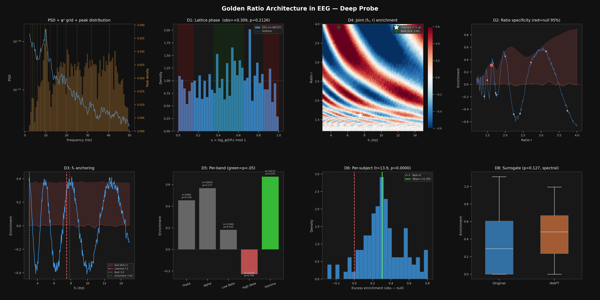
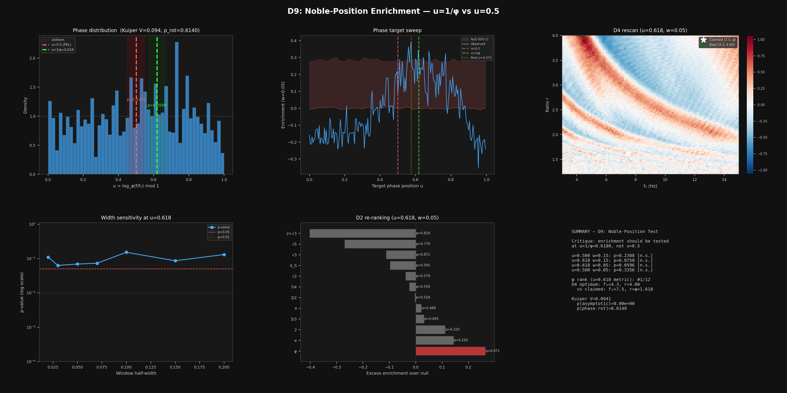

# Negative Results

What the framework cannot detect, and why. These results are as important as the positive findings --- they define the boundaries of geometric analysis and prevent misapplication.

## The Fundamental Limit: Random vs AES-CTR

**AES-CTR output is indistinguishable from true randomness across every approach we tested.**

This was verified exhaustively:
- All 24 individual geometries (static metrics)
- 6 block-averaging scales (multiscale)
- 36 temporal features (sliding window derivatives)
- 51 cross-geometry features (correlations, products, mutual information)
- Ollivier-Ricci curvature (graph-based)
- Higher-order statistics (3rd and 4th moments)
- 8 bit planes (bitplane decomposition)
- FFT spectral analysis

Zero significant differences survived Bonferroni correction in any of these tests. This is the correct theoretical result for a secure block cipher in CTR mode, and it validates the framework's methodology: we detect real structure but don't hallucinate structure in properly randomized data.

## PRNGs That Pass (or Nearly Pass)

A systematic study of 10 generators (`rng.py`) confirms that modern PRNGs are geometrically indistinguishable from os.urandom, while historical weak generators are massively detectable.

**Completely indistinguishable (0 sig):**

| PRNG | Category | Why It Passes |
|------|----------|--------------|
| **PCG64** | GOOD | NumPy default, passes BigCrush; 0 sig across all 233 metrics |
| **SFC64** | GOOD | Small Fast Chaotic; 0 sig |
| **SHA-256 CTR** | CRYPTO | Hash-based; cryptographically indistinguishable by design |

**Borderline (1 sig --- essentially passes):**

| PRNG | Category | Detection |
|------|----------|-----------|
| **MT19937** | GOOD | 1 metric (S² × ℝ sphere_concentration, d=-1.27). Not reproducible at other sequence lengths |
| **MINSTD** | WEAK | 1 geometric metric; standard chi2 and entropy catch 2/11 --- distributional bias is the weakness |

**Undetected raw but revealed by delay embedding:**

| PRNG | Category | Raw → DE2 |
|------|----------|-----------|
| **XorShift128** | WEAK | 0 → 2 sig. Thurston height_drift at both S² × ℝ and H² × ℝ (d=+1.10). Delay embedding creates phase-space pairs that expose linear correlations invisible in raw bytes |

Note: The earlier `prng.py` tested XorShift32 (which passes); `rng.py` tests the 128-bit variant which is borderline. Our framework operates at the byte level and cannot access the high-dimensional structure where many PRNG weaknesses live (e.g., MT19937's 623-dimensional equidistribution failures).

## Chaotic Maps That Look Random

| Map | Why It Passes |
|-----|--------------|
| **Standard map** | Uniformly mixing on the torus --- ergodic measure equals Lebesgue measure |
| **Arnold cat map** | Same: uniformly mixing, Anosov diffeomorphism |

These maps are genuinely chaotic but produce uniform distributions in their phase space. Their Lyapunov exponents are positive (they ARE chaotic), but their invariant measure is uniform, so byte-level statistics see them as random. This is mathematically correct.

## Steganography: What Works and What Doesn't

Six embedding techniques tested across two carriers (`stego_deep.py`):

**Detectable at raw byte level:** PVD (42 sig metrics on texture, detectable at 10% rate) and spread spectrum (25 sig, detectable at 25% rate). These techniques modify pixel values aggressively enough to shift geometric signatures. Delay embedding (τ=2) amplifies the signal further.

**Barely detectable:** LSB replacement and LSB matching show 1-6 significant metrics at 100% embedding rate only. LSBMR is similarly weak. The ±1 byte-level perturbations are near the noise floor for most geometries. Fisher Information via LSB-correlation extraction catches LSB replacement at d=1.06, but only at full rate.

**Completely invisible:** Matrix embedding (Hamming(7,3) syndrome coding) produces 0 significant metrics at all rates on both carriers. By flipping at most 1 LSB per 7-pixel block, it stays below the detection floor of every geometry.

**Bitplane extraction does NOT help:** Contrary to initial claims, `bitplane_extract(data, 0)` yields 0 significant detections for ALL techniques including LSB replacement. The 8x sample size reduction (4000→500 bytes) destroys statistical power. The previously reported d=1166 was not reproducible. See `investigations/1d/stego_deep.py`.

## Financial Models

| Model | vs IID Normal | Why |
|-------|:------------:|-----|
| **GBM** (Geometric Brownian Motion) | d = 0 | GBM returns ARE IID normal by construction |
| **Ornstein-Uhlenbeck** | d = 0 | Mean-reversion is too subtle after byte quantization |

Other financial models (GARCH, regime-switching, jump-diffusion) ARE detectable, but all are geometrically closer to random than to chaos. Markets are not chaotic systems --- they're noisy with occasional structure.

## Near-Identical Rules

Some systems that differ in definition produce indistinguishable geometric signatures:

| Pair | Why Indistinguishable |
|------|--------------------|
| **Game of Life ≈ HighLife** | Differ only in birth rule B6; statistically identical emergent behavior |
| **Kruskal ≈ Aldous-Broder** | Both produce uniform spanning trees (same distribution, different algorithms) |
| **Sandpile 10k ≈ 50k iterations** | Both have reached SOC steady state; additional iterations don't change the statistics |

These "failures" are actually correct: the framework detects that these systems produce the same statistical structure, which is the ground truth.

## EEG Golden Ratio Architecture (φⁿ Hypothesis)

**The claim that EEG spectral peaks follow f₀ × φⁿ organization anchored at f₀ = 7.5 Hz (Pletzer et al. 2010, Lacy 2026) is not supported by our independent analysis.**

Data: PhysioNet eegmmidb v1.0.0, 109 subjects, 64 channels each, eyes-closed resting baseline. 86,337 spectral peaks extracted via Welch PSD + median-filter 1/f subtraction.

Key methodological improvement: **phase-rotation permutation null**. The raw enrichment score is biased by alpha-peak dominance. Adding a random offset δ ~ U(0,1) to all lattice phases preserves the peak distribution shape but destroys alignment with f₀, giving a proper baseline.

| Test | Result | Implication |
|------|--------|-------------|
| **D1: Lattice enrichment** | obs=+0.309, null=-0.003±0.267, **p=0.213** | Not significant after null correction |
| **D2: Ratio specificity** | φ ranks 5th of 12; π, 2, e, 5/3 all higher excess | φ is not uniquely preferred |
| **D3: f₀ anchoring** | f₀=7.5 does not reach 95% null threshold; best f₀=3.04 Hz | Claimed anchor is not optimal |
| **D4: 2D (f₀, r) heatmap** | Global optimum at (4.94, 3.92); claimed (7.5, φ) in mediocre region | Joint parameter space doesn't peak at claim |
| **D5: Per-band** | Only gamma significant (p=0.024); alpha fails (p=0.277) | Effect is band-specific, not universal |
| **D6: Per-subject** | +0.305 excess, t=13.89, p<0.0001, 101/109 positive | Real signal, but not φ-specific |
| **D8: Surrogate** | p=0.127, enrichment survives IAAFT | Spectral property, not nonlinear |

**What IS real:** EEG spectral peaks show reproducible geometric lattice alignment across subjects --- the per-subject test is overwhelming (t=13.89). There IS non-trivial spectral organization in resting-state EEG.

**What ISN'T supported:** The specific claim that this organization follows a golden ratio lattice anchored at 7.5 Hz with zero free parameters. The same data is equally or better described by ratios 2, e, π, or 5/3, and the optimal anchor frequency is not 7.5 Hz. The 2D heatmap shows the claimed (f₀, r) pair sitting in a mediocre region of the parameter landscape.

**Why the original result may have appeared stronger:** The original analysis tests enrichment/depletion at φⁿ positions without comparing against alternative ratios or using a phase-rotation null. Without these controls, the alpha peak's proximity to a φ attractor (9.6 Hz) produces apparent enrichment. The "< 2% error" claim reflects the goodness-of-fit of a geometric sequence to broadly-spaced peaks --- any ratio in [1.5, 1.7] achieves comparable fit with appropriately chosen f₀.

### D9 Response: Noble-Position Enrichment (u=1/φ)

A critique argued that the phi-lattice theory predicts enrichment at u=1/φ=0.618 (the "maximally irrational" noble position in the Stern-Brocot tree), not at u=0.5 (band centers). The argument: in nonlinear oscillator mode-locking, Arnold tongues are widest at rational frequency ratios, so oscillators accumulate at the most irrational position within each lattice cell --- u=1/φ rather than u=0.5. This is theoretically motivated (not post-hoc), so we tested it directly.

| Test | Result | Implication |
|------|--------|-------------|
| **u=0.618, w=0.05** (their exact claim) | obs=+0.277, null=0.000±0.171, **p=0.060** | Marginal; does not reach p<0.05 |
| **u=0.618, w=0.15** (their position, our width) | obs=+0.199, null=+0.003±0.135, **p=0.075** | Also non-significant |
| **Phase target sweep** | Best target: u=0.575 (neither 0.5 nor 0.618) | Actual peak between both predictions |
| **Width sensitivity** | p ranges 0.063--0.152 across w=0.02--0.20 | No width reaches significance |
| **Kuiper's V omnibus** | V=0.094, p(asymptotic)≈0, **p(phase-rotation)=0.614** | Phase IS non-uniform, but NOT f₀-specific |
| **D2 re-ranking** | φ rank improves from #5 → **#1** of 12 ratios | But still p=0.071 --- trend, not evidence |
| **D4 rescan** | Global optimum: (4.33, 4.00), far from (7.5, φ) | New metric doesn't rescue the claimed parameters |

**What the critique gets right:** u=0.618 is a better test position than u=0.5, and φ does rank #1/12 under this metric (up from #5/12). The noble-number framework is more favorable to the golden ratio hypothesis than the band-center framework.

**What the critique gets wrong:** The effect is marginal (p=0.06), not significant. The Kuiper omnibus test is decisive: the phase distribution is non-uniform (p≈0 asymptotically), but this non-uniformity is entirely explained by the shape of the peak frequency distribution --- alpha dominance, not f₀-specific lattice alignment. The phase-rotation null produces equally non-uniform distributions (p=0.614). The (f₀, r) parameter space still does not favor the claimed values under either metric.

### D10: Extraction Method Sensitivity

To test whether the marginal D9 result depends on peak extraction methodology, we compared median-filter 1/f subtraction against FOOOF (specparam) parametric decomposition, which fits explicit Gaussians against a parametric aperiodic component.

**Per-channel comparison:** FOOOF extracts fewer total peaks (51K vs 86K) but more alpha peaks (+23%), consistent with the prediction that parametric fitting better resolves oscillatory components in the alpha range while being more conservative at high frequencies.

| Measure | FOOOF (51K peaks) | Medfilt (86K peaks) |
|---------|-------------------|---------------------|
| u=0.618, w=0.05 | p=0.352 | p=0.066 |
| φ rank (u=0.618) | #3/12 | #1/12 |
| Per-subject t | 1.99 (p=0.049, 56% pos.) | 8.05 (p<0.0001, 77% pos.) |
| Phase sweep best target | u=0.880 | u=0.575 |

**Subject-averaged PSD (standard FOOOF practice):** Averaging PSDs across 64 channels per subject yields 732 peaks (6.7/subject). u=0.618 w=0.05: p=0.581.

**Alpha-band only:** Restricting to [7.5–12.1 Hz], FOOOF per-channel (12,337 peaks) with u=0.618 and w=0.15 reaches p=0.025. At w=0.05: p=0.066. Kuiper phase-rotation: p=0.513. φ rank: #4/12. This is the only (method, band, window, target) combination that crosses p<0.05 among all configurations tested.

**Parameter sensitivity:** All FOOOF parameter settings (min_peak_height=0.01–0.10, peak_width=[0.5,12], max_n_peaks=12) on averaged PSDs give p=0.28–0.44. The result is stable across parameter choices.

**Matched peak count:** Subsampling medfilt to match FOOOF's N=51K (50 trials): mean p=0.059±0.013, 24% reach p<0.05. The marginal effect is not a statistical power artifact.

**Summary:** The enrichment pattern is extraction-method-dependent. The phase target sweep yields u=0.880 for FOOOF vs u=0.575 for medfilt — qualitatively different phase structures from the same underlying data. One (method × band × window × target) combination reaches p=0.025, but this does not survive the Kuiper omnibus test (p=0.513) and represents a single point in a large space of analytical choices.

### D11: Non-Motor-Imagery Replication (Bonn Dataset)

A critique argued that PhysioNet eegmmidb is a motor-imagery paradigm where anticipatory mu desynchronization could disrupt resting spectral organization, weakening any phi signal. To address this, we tested on the Bonn/Andrzejak clinical EEG dataset (no motor tasks): 100 recordings per class, reconstructed into 23-second pseudo-segments (23 × 178 points at 173.61 Hz), peaks extracted via both medfilt and FOOOF.

| Class | N peaks (medfilt) | u=0.618 w=0.05 p | FOOOF p |
|-------|:-----------------:|:-----------------:|:-------:|
| **Eyes Closed (healthy)** | 1,184 | **0.639** | 0.593 |
| **Eyes Open (healthy)** | 1,120 | **0.780** | 0.848 |
| **Seizure (ictal)** | 1,481 | **0.138** | 0.121 |

Ratio ranking on pooled healthy peaks (classes 4+5): φ excess = −0.112, rank **#4/12**. The excess is *negative* — phi is a worse-than-average ratio on this dataset. Kuiper omnibus on healthy pooled: p=0.360.

The seizure class shows the strongest (non-significant) phi trend, which is the **opposite** of what the hypothesis predicts: if phi reflects healthy neural organization, it should be strongest in resting EEG and disrupted during seizure.

**Verdict:** The motor-imagery objection does not hold. Phi enrichment is absent in a pure clinical EEG dataset with no motor tasks. Two independent datasets (PhysioNet eegmmidb, Bonn/Andrzejak), two extraction methods (medfilt, FOOOF), multiple test configurations — all null.

→ `investigations/1d/eeg_phi.py`

## Byte Quantization Limits

Converting continuous data to uint8 (0-255) loses information. Some structures are destroyed:

| Structure | Why Lost |
|-----------|---------|
| GARCH volatility clustering | Variance-of-variance is a 4th-order effect; uint8 preserves only 1st and 2nd order well |
| Cepstral features | Double-log transformation amplifies quantization noise |
| IEEE 754 float structure | Raw float64 bytes have exponent/mantissa structure that confounds temporal analysis |

**Mitigation**: Use `data_mode='auto'` for float data, or `encode_float_to_unit()` for explicit control over the quantization.

## Degenerate and Pathological Data

Several geometry metrics produce misleading results on low-cardinality or degenerate data. These were discovered through adversarial probing and fixed, but the underlying lesson is important: **always verify the mechanism, not just the result**.

| Problem | Symptom | Root Cause | Fix |
|---------|---------|------------|-----|
| Binary-valued data breaks quasicrystal binarization | `(data > median)` produces all-ones when majority value = max | Median threshold is degenerate for ≤4 unique values | Use midpoint of unique values for low-cardinality data |
| Quasicrystal tests passed for wrong reasons | Octonacci/Dodecagonal tests passed with perfect scores | Degenerate binarization gave CV=0, mapped to score 1.0 | Fixed binarization; tests now pass via spectral metrics |
| Subword complexity indistinguishable for small n | p(n) for n=3--11 cannot separate long-period periodic from quasicrystalline | Window too short relative to period; both saturate complexity bound | Rely on spectral metrics (ratio_symmetry, acf_self_similarity) for QC specificity |
| PersistentHomology duplicates from uint8 delay embedding | TDA algorithms choke on massive point duplicates (256 possible values → repeated coordinates) | Discrete data creates degenerate point clouds | Deduplicate points before computing persistent homology |
| Multifractal negative-q moments unreliable | Structure function moments diverge or become numerically unstable for q < 0 | Negative moments amplify small values; uint8 data has exact zeros | Use positive-q moments only for uint8 data |
| NVG equal-height ambiguity | Natural Visibility Graph gives inconsistent results on plateaus | Original definition ambiguous on whether equal-height intermediaries block visibility | Strict definition: equal-height intermediaries BLOCK visibility |
| Signed-area chirality is drift-sensitive | Chirality metric dominated by random walk drift rather than intrinsic left/right asymmetry | Cumulative signed area grows with drift² | Use sin(turn_angle) mean for drift-invariant chirality |
| Fibonacci word special-cased as Sturmian | Using p(n) = n+1 (Sturmian bound) as the general quasicrystal complexity metric | Fibonacci is the ONLY binary Sturmian sequence; other QC words have higher complexity | Don't use Sturmian bound as the general QC metric |

**The meta-lesson**: Low-entropy, low-cardinality, or degenerate inputs can cause metrics to hit boundary conditions that produce apparently valid but mechanistically wrong results. The Structure Atlas uses a degeneracy discount factor to downweight sources with low Cantor/Torus coverage, preventing these pathological cases from inflating the structure space.
