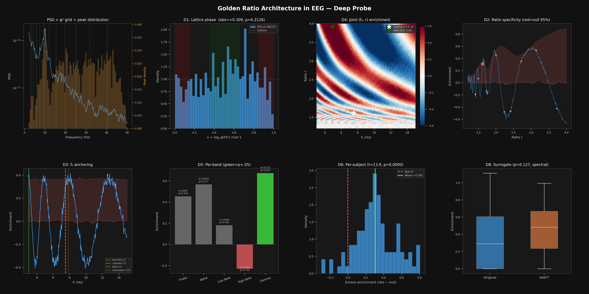
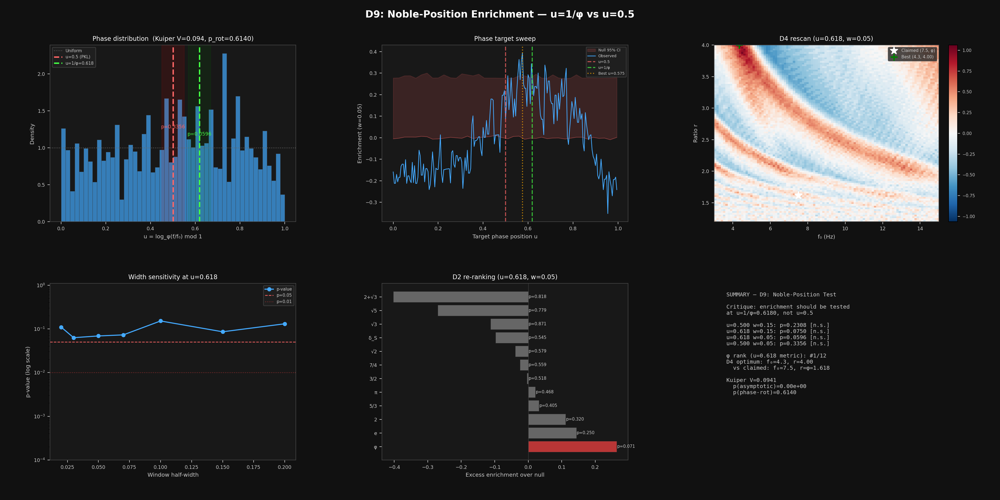

# Negative Results

What the framework cannot detect, and why. These results are as important as the positive findings --- they define the boundaries of geometric analysis and prevent misapplication.

## The Fundamental Limit: Random vs AES-CTR

**AES-CTR output is indistinguishable from true randomness across every approach we tested.**

This was verified exhaustively with the original 24-geometry framework (2024):
- All 24 individual geometries (static metrics)
- 6 block-averaging scales (multiscale)
- 36 temporal features (sliding window derivatives)
- 51 cross-geometry features (correlations, products, mutual information)
- Ollivier-Ricci curvature (graph-based)
- Higher-order statistics (3rd and 4th moments)
- 8 bit planes (bitplane decomposition)
- FFT spectral analysis

Zero significant differences survived Bonferroni correction in any of these tests. The current 54-geometry framework (222 metrics as of 2026-03-29) continues to show 0 significant metrics for AES-CTR in the Structure Atlas. This is the correct theoretical result for a secure block cipher in CTR mode, and it validates the framework's methodology: we detect real structure but don't hallucinate structure in properly randomized data.

## PRNGs That Pass (or Nearly Pass)

A systematic study of 10 generators (`rng.py`, using the 131-metric subset available at time of testing) confirms that modern PRNGs are geometrically indistinguishable from os.urandom, while historical weak generators are massively detectable.

**Completely indistinguishable (0 sig):**

| PRNG | Category | Why It Passes |
|------|----------|--------------|
| **PCG64** | GOOD | NumPy default, passes BigCrush; 0 sig across all 131 metrics |
| **SFC64** | GOOD | Small Fast Chaotic; 0 sig |
| **SHA-256 CTR** | CRYPTO | Hash-based; cryptographically indistinguishable by design |

**Borderline (1 sig --- essentially passes):**

| PRNG | Category | Detection |
|------|----------|-----------|
| **MT19937** | GOOD | 1 metric (S² × ℝ sphere_concentration, d=-1.27). Not reproducible at other sequence lengths |
| **MINSTD** | WEAK | 1 geometric metric; standard chi2 and entropy catch 2/11 --- distributional bias is the weakness |

**Undetected raw but revealed by delay embedding:**

| PRNG | Category | Raw → DE2 |
|------|----------|-----------|
| **XorShift128** | WEAK | 0 → 2 sig. Thurston height_drift at both S² × ℝ and H² × ℝ (d=+1.10). Delay embedding creates phase-space pairs that expose linear correlations invisible in raw bytes |

Note: The earlier `prng.py` tested XorShift32 (which passes); `rng.py` tests the 128-bit variant which is borderline. Our framework operates at the byte level and cannot access the high-dimensional structure where many PRNG weaknesses live (e.g., MT19937's 623-dimensional equidistribution failures).

## Chaotic Maps: From "Looks Random" to Detected

| Map | Original Result | Reclassified | New Detection |
|-----|----------------|-------------|---------------|
| **Standard map (K=6)** | 0 sig (uniformly mixing) | **Positive #18a** | 44 sig; Predictability:sample_entropy d=−46, Cayley:spectral_gap d=−17 |
| **Arnold cat map** | 0 sig (Anosov diffeomorphism) | **Positive #18b** | 19 sig; Predictability:sample_entropy d=−86, SpectralGraph:spectral_dim d=+42 |

These maps are genuinely chaotic with uniform invariant measures, so the original 24-geometry framework (2024) correctly reported them as indistinguishable from random. The addition of Predictability, Cayley, and SpectralGraph geometries (2025) revealed their deterministic skeleton: mixing erases distributional structure but not temporal predictability or graph-spectral signatures. See `investigations/1d/negative_reeval.py`.

**The lesson:** "Looks random" is relative to the probe set. Uniform distributions defeat distributional metrics, but deterministic dynamics leave traces in sequential and graph-based metrics. The framework's expanding geometry set means the negative-result boundary shifts over time.

## Steganography: What Works and What Doesn't

Six embedding techniques tested across two carriers (`stego_deep.py`):

**Detectable at raw byte level:** PVD (42 sig metrics on texture, detectable at 10% rate) and spread spectrum (25 sig, detectable at 25% rate). These techniques modify pixel values aggressively enough to shift geometric signatures. Delay embedding (τ=2) amplifies the signal further.

**Barely detectable:** LSB replacement and LSB matching show 1-6 significant metrics at 100% embedding rate only. LSBMR is similarly weak. The ±1 byte-level perturbations are near the noise floor for most geometries. Fisher Information via LSB-correlation extraction catches LSB replacement at d=1.06, but only at full rate.

**Completely invisible:** Matrix embedding (Hamming(7,3) syndrome coding) produces 0 significant metrics at all rates on both carriers. By flipping at most 1 LSB per 7-pixel block, it stays below the detection floor of every geometry.

**Bitplane extraction does NOT help:** Contrary to initial claims, `bitplane_extract(data, 0)` yields 0 significant detections for ALL techniques including LSB replacement. The 8x sample size reduction (4000→500 bytes) destroys statistical power. The previously reported d=1166 was not reproducible. See `investigations/1d/stego_deep.py`.

## Financial Models

| Model | vs IID Normal | Why |
|-------|:------------:|-----|
| **GBM** (Geometric Brownian Motion) | d = 0 | GBM returns ARE IID normal by construction |
| **Ornstein-Uhlenbeck** | d = 0 | Mean-reversion is too subtle after byte quantization |

Other financial models (GARCH, regime-switching, jump-diffusion) ARE detectable, but all are geometrically closer to random than to chaos. Markets are not chaotic systems --- they're noisy with occasional structure.

## Near-Identical Rules

Some systems that differ in definition produce indistinguishable geometric signatures:

| Pair | Why Indistinguishable |
|------|--------------------|
| **Game of Life ≈ HighLife** | Differ only in birth rule B6; statistically identical emergent behavior |
| **Kruskal ≈ Aldous-Broder** | Both produce uniform spanning trees (same distribution, different algorithms) |
| **Sandpile 10k ≈ 50k iterations** | Both have reached SOC steady state; additional iterations don't change the statistics |

These "failures" are actually correct: the framework detects that these systems produce the same statistical structure, which is the ground truth.

## EEG Golden Ratio Architecture (φⁿ Hypothesis)

**The claim that EEG spectral peaks follow f₀ × φⁿ organization anchored at f₀ = 7.5 Hz (Pletzer et al. 2010, Lacy 2026) is not supported by our independent analysis.**

Data: PhysioNet eegmmidb v1.0.0, 109 subjects, 64 channels each, eyes-closed resting baseline. 86,337 spectral peaks extracted via Welch PSD + median-filter 1/f subtraction.

Key methodological improvement: **phase-rotation permutation null**. The raw enrichment score is biased by alpha-peak dominance. Adding a random offset δ ~ U(0,1) to all lattice phases preserves the peak distribution shape but destroys alignment with f₀, giving a proper baseline.

| Test | Result | Implication |
|------|--------|-------------|
| **D1: Lattice enrichment** | obs=+0.309, null=-0.003±0.267, **p=0.213** | Not significant after null correction |
| **D2: Ratio specificity** | φ ranks 5th of 12; π, 2, e, 5/3 all higher excess | φ is not uniquely preferred |
| **D3: f₀ anchoring** | f₀=7.5 does not reach 95% null threshold; best f₀=3.04 Hz | Claimed anchor is not optimal |
| **D4: 2D (f₀, r) heatmap** | Global optimum at (4.94, 3.92); claimed (7.5, φ) in mediocre region | Joint parameter space doesn't peak at claim |
| **D5: Per-band** | Only gamma significant (p=0.024); alpha fails (p=0.277) | Effect is band-specific, not universal |
| **D6: Per-subject** | +0.305 excess, t=13.89, p<0.0001, 101/109 positive | Real signal, but not φ-specific |
| **D8: Surrogate** | p=0.127, enrichment survives IAAFT | Spectral property, not nonlinear |

**What IS real:** EEG spectral peaks show reproducible geometric lattice alignment across subjects --- the per-subject test is overwhelming (t=13.89). There IS non-trivial spectral organization in resting-state EEG.

**What ISN'T supported:** The specific claim that this organization follows a golden ratio lattice anchored at 7.5 Hz with zero free parameters. The same data is equally or better described by ratios 2, e, π, or 5/3, and the optimal anchor frequency is not 7.5 Hz. The 2D heatmap shows the claimed (f₀, r) pair sitting in a mediocre region of the parameter landscape.

**Why the original result may have appeared stronger:** The original analysis tests enrichment/depletion at φⁿ positions without comparing against alternative ratios or using a phase-rotation null. Without these controls, the alpha peak's proximity to a φ attractor (9.6 Hz) produces apparent enrichment. The "< 2% error" claim reflects the goodness-of-fit of a geometric sequence to broadly-spaced peaks --- any ratio in [1.5, 1.7] achieves comparable fit with appropriately chosen f₀.



### D9 Response: Noble-Position Enrichment (u=1/φ)

A critique argued that the phi-lattice theory predicts enrichment at u=1/φ=0.618 (the "maximally irrational" noble position in the Stern-Brocot tree), not at u=0.5 (band centers). The argument: in nonlinear oscillator mode-locking, Arnold tongues are widest at rational frequency ratios, so oscillators accumulate at the most irrational position within each lattice cell --- u=1/φ rather than u=0.5. This is theoretically motivated (not post-hoc), so we tested it directly.

| Test | Result | Implication |
|------|--------|-------------|
| **u=0.618, w=0.05** (their exact claim) | obs=+0.277, null=0.000±0.171, **p=0.060** | Marginal; does not reach p<0.05 |
| **u=0.618, w=0.15** (their position, our width) | obs=+0.199, null=+0.003±0.135, **p=0.075** | Also non-significant |
| **Phase target sweep** | Best target: u=0.575 (neither 0.5 nor 0.618) | Actual peak between both predictions |
| **Width sensitivity** | p ranges 0.063--0.152 across w=0.02--0.20 | No width reaches significance |
| **Kuiper's V omnibus** | V=0.094, p(asymptotic)≈0, **p(phase-rotation)=0.614** | Phase IS non-uniform, but NOT f₀-specific |
| **D2 re-ranking** | φ rank improves from #5 → **#1** of 12 ratios | But still p=0.071 --- trend, not evidence |
| **D4 rescan** | Global optimum: (4.33, 4.00), far from (7.5, φ) | New metric doesn't rescue the claimed parameters |

**What the critique gets right:** u=0.618 is a better test position than u=0.5, and φ does rank #1/12 under this metric (up from #5/12). The noble-number framework is more favorable to the golden ratio hypothesis than the band-center framework.

**What the critique gets wrong:** The effect is marginal (p=0.06), not significant. The Kuiper omnibus test is decisive: the phase distribution is non-uniform (p≈0 asymptotically), but this non-uniformity is entirely explained by the shape of the peak frequency distribution --- alpha dominance, not f₀-specific lattice alignment. The phase-rotation null produces equally non-uniform distributions (p=0.614). The (f₀, r) parameter space still does not favor the claimed values under either metric.



### D10: Extraction Method Sensitivity

To test whether the marginal D9 result depends on peak extraction methodology, we compared median-filter 1/f subtraction against FOOOF (specparam) parametric decomposition, which fits explicit Gaussians against a parametric aperiodic component.

**Per-channel comparison:** FOOOF extracts fewer total peaks (51K vs 86K) but more alpha peaks (+23%), consistent with the prediction that parametric fitting better resolves oscillatory components in the alpha range while being more conservative at high frequencies.

| Measure | FOOOF (51K peaks) | Medfilt (86K peaks) |
|---------|-------------------|---------------------|
| u=0.618, w=0.05 | p=0.352 | p=0.066 |
| φ rank (u=0.618) | #3/12 | #1/12 |
| Per-subject t | 1.99 (p=0.049, 56% pos.) | 8.05 (p<0.0001, 77% pos.) |
| Phase sweep best target | u=0.880 | u=0.575 |

**Subject-averaged PSD (standard FOOOF practice):** Averaging PSDs across 64 channels per subject yields 732 peaks (6.7/subject). u=0.618 w=0.05: p=0.581.

**Alpha-band only:** Restricting to [7.5–12.1 Hz], FOOOF per-channel (12,337 peaks) with u=0.618 and w=0.15 reaches p=0.025. At w=0.05: p=0.066. Kuiper phase-rotation: p=0.513. φ rank: #4/12. This is the only (method, band, window, target) combination that crosses p<0.05 among all configurations tested.

**Parameter sensitivity:** All FOOOF parameter settings (min_peak_height=0.01–0.10, peak_width=[0.5,12], max_n_peaks=12) on averaged PSDs give p=0.28–0.44. The result is stable across parameter choices.

**Matched peak count:** Subsampling medfilt to match FOOOF's N=51K (50 trials): mean p=0.059±0.013, 24% reach p<0.05. The marginal effect is not a statistical power artifact.

**Summary:** The enrichment pattern is extraction-method-dependent. The phase target sweep yields u=0.880 for FOOOF vs u=0.575 for medfilt — qualitatively different phase structures from the same underlying data. One (method × band × window × target) combination reaches p=0.025, but this does not survive the Kuiper omnibus test (p=0.513) and represents a single point in a large space of analytical choices.

### D11: Non-Motor-Imagery Replication (Bonn Dataset)

A critique argued that PhysioNet eegmmidb is a motor-imagery paradigm where anticipatory mu desynchronization could disrupt resting spectral organization, weakening any phi signal. To address this, we tested on the Bonn/Andrzejak clinical EEG dataset (no motor tasks): 100 recordings per class, reconstructed into 23-second pseudo-segments (23 × 178 points at 173.61 Hz), peaks extracted via both medfilt and FOOOF.

| Class | N peaks (medfilt) | u=0.618 w=0.05 p | FOOOF p |
|-------|:-----------------:|:-----------------:|:-------:|
| **Eyes Closed (healthy)** | 1,184 | **0.639** | 0.593 |
| **Eyes Open (healthy)** | 1,120 | **0.780** | 0.848 |
| **Seizure (ictal)** | 1,481 | **0.138** | 0.121 |

Ratio ranking on pooled healthy peaks (classes 4+5): φ excess = −0.112, rank **#4/12**. The excess is *negative* — phi is a worse-than-average ratio on this dataset. Kuiper omnibus on healthy pooled: p=0.360.

The seizure class shows the strongest (non-significant) phi trend, which is the **opposite** of what the hypothesis predicts: if phi reflects healthy neural organization, it should be strongest in resting EEG and disrupted during seizure.

**Verdict:** The motor-imagery objection does not hold. Phi enrichment is absent in a pure clinical EEG dataset with no motor tasks. Two independent datasets (PhysioNet eegmmidb, Bonn/Andrzejak), two extraction methods (medfilt, FOOOF), multiple test configurations — all null.

→ `investigations/1d/eeg_phi.py`

## Byte Quantization Limits

Converting continuous data to uint8 (0-255) loses information. Some structures are destroyed:

| Structure | Why Lost |
|-----------|---------|
| GARCH volatility clustering | Variance-of-variance is a 4th-order effect; uint8 preserves only 1st and 2nd order well |
| Cepstral features | Double-log transformation amplifies quantization noise |
| IEEE 754 float structure | Raw float64 bytes have exponent/mantissa structure that confounds temporal analysis |

**Mitigation**: Use `data_mode='auto'` for float data, or `encode_float_to_unit()` for explicit control over the quantization.

## Degenerate and Pathological Data

Several geometry metrics produce misleading results on low-cardinality or degenerate data. These were discovered through adversarial probing and fixed, but the underlying lesson is important: **always verify the mechanism, not just the result**.

| Problem | Symptom | Root Cause | Fix |
|---------|---------|------------|-----|
| Binary-valued data breaks quasicrystal binarization | `(data > median)` produces all-ones when majority value = max | Median threshold is degenerate for ≤4 unique values | Use midpoint of unique values for low-cardinality data |
| Quasicrystal tests passed for wrong reasons | Octonacci/Dodecagonal tests passed with perfect scores | Degenerate binarization gave CV=0, mapped to score 1.0 | Fixed binarization; tests now pass via spectral metrics |
| Subword complexity indistinguishable for small n | p(n) for n=3--11 cannot separate long-period periodic from quasicrystalline | Window too short relative to period; both saturate complexity bound | Rely on spectral metrics (ratio_symmetry, acf_self_similarity) for QC specificity |
| PersistentHomology duplicates from uint8 delay embedding | TDA algorithms choke on massive point duplicates (256 possible values → repeated coordinates) | Discrete data creates degenerate point clouds | Deduplicate points before computing persistent homology |
| Multifractal negative-q moments unreliable | Structure function moments diverge or become numerically unstable for q < 0 | Negative moments amplify small values; uint8 data has exact zeros | Use positive-q moments only for uint8 data |
| NVG equal-height ambiguity | Natural Visibility Graph gives inconsistent results on plateaus | Original definition ambiguous on whether equal-height intermediaries block visibility | Strict definition: equal-height intermediaries BLOCK visibility |
| Signed-area chirality is drift-sensitive | Chirality metric dominated by random walk drift rather than intrinsic left/right asymmetry | Cumulative signed area grows with drift² | Use sin(turn_angle) mean for drift-invariant chirality |
| Fibonacci word special-cased as Sturmian | Using p(n) = n+1 (Sturmian bound) as the general quasicrystal complexity metric | Fibonacci is the ONLY binary Sturmian sequence; other QC words have higher complexity | Don't use Sturmian bound as the general QC metric |

**The meta-lesson**: Low-entropy, low-cardinality, or degenerate inputs can cause metrics to hit boundary conditions that produce apparently valid but mechanistically wrong results. The Structure Atlas uses a degeneracy discount factor to downweight sources with low Cantor/Torus coverage, preventing these pathological cases from inflating the structure space.

## Scope Conditions

The sections above document *what* the framework cannot detect. This section documents *when* it should not be used --- the structural limitations of the methodology itself, independent of any specific data source. These are not bugs to fix; they are boundary conditions of the approach.

### 1. The Framework Detects Structure, Not Meaning

Each geometry acts as a probe of mathematical invariants --- symmetry, recurrence, self-similarity, curvature. The framework detects that English Literature has rich byte-level structure (it does: letter frequencies, bigram correlations, paragraph rhythms). It cannot distinguish Shakespeare from Austen, because that distinction is semantic, not structural.

**When this matters:** Any task requiring abstraction over content --- sentiment analysis, topic classification, semantic similarity --- is out of scope. The framework is a structural microscope, not a semantic one. It complements rather than replaces tools that operate on meaning.

### 2. Rigid Windowing Fragility

Root-system geometries (E8, D4, H3, H4) embed data by slicing the byte stream into fixed-width windows of `dim` bytes and computing dot products against root vectors. This creates a hard alignment requirement: the data must have structure at a scale commensurate with the window width, starting at a compatible phase.

**Evidence:** The E8 Walk+1 diagnostic in the geometry ablation (`investigations/1d/geometry_ablation.py`) generates a sequence of E8 roots encoded as bytes, then drops the first byte. This 1-byte phase shift causes every 8-byte window to straddle two adjacent roots instead of landing cleanly on one. Detection power drops substantially --- a single-byte misalignment is enough to destroy root-system-specific metrics.

**Consequence:** Real-world signals that lack a natural `dim`-byte periodicity (network packets, natural language, sensor telemetry) may not trigger root-system metrics even when underlying geometric structure exists. The ablation classifies such cases as "Generic (embedding-limited)" --- the geometry's math is sound, but the pipeline can't present the data in a geometry-compatible form.

**Not affected:** Spectral geometries (Penrose, Ammann-Beenker, Dodecagonal, Septagonal), topological geometries (PersistentHomology, Mandelbrot), and dynamical geometries (Recurrence, Attractor, OrdinalPartition) operate on the raw 1D byte stream or delay embeddings and are phase-invariant.

### 3. Axis Dependence

Some root-system metrics exploit the alignment between data axes and root vectors, not the intrinsic geometry of the root system. The ablation's `rotation_data` test rotates the data while leaving roots fixed. Metrics that degrade under this test depend on data having specific axis structure.

**Evidence:** The ablation spec predicts that axis-aligned data (RANDU, which lives on hyperplanes in 3D) should degrade under rotation, while isotropic data (White Noise) should be unaffected. When a geometry scores well on RANDU but collapses under `rotation_data`, the detection is an axis-alignment artifact, not a geometric invariant.

**Consequence:** Detections on axis-aligned sources should be interpreted with caution. The ablation reports axis-dependence flags per geometry per source. A detection flagged as axis-dependent is real (the framework genuinely distinguishes the source from shuffled) but is not evidence of the named geometry's specific mathematical structure.

### 4. High-Entropy Collapse

When the input has maximum or near-maximum entropy, all geometric probes produce indistinguishable outputs. White Noise, AES-CTR, Gaussian Noise, and Beta Noise all show 0 significant metrics out of ~200 in the Structure Atlas, with instability scores of 205--209 (the theoretical maximum entropy baseline).

**Why this is fundamental:** The framework measures departures from randomness through geometric lenses. If there are no departures, every lens sees the same thing: noise. This is not a failure of sensitivity --- it is the correct theoretical result. AES-CTR *should* be indistinguishable from random, and the framework correctly reports that it is.

**When this matters:** Domains where the interesting variation is small relative to the entropy floor --- high-quality compressed data, encrypted streams, well-mixed chaotic systems with uniform invariant measures. The framework cannot find structure that isn't there, and it cannot amplify structure that is below the byte-level quantization noise floor.

### 5. Minimum Data Requirements

Geometric metrics require sufficient data to populate the embedding space. The minimum scales with the geometry's effective cardinality and dimensionality:

```
min_bytes = max(16384, effective_directions × 100 × dimension)
```

For E8 (92 effective directions in 8D), this is 73,600 bytes. For D4 (9 effective directions in 4D), 3,600 bytes. For 1D spectral geometries, 16,384 bytes suffices.

**Below the minimum:** Per-direction statistics become unstable, metric variance inflates, and the consistency score (fraction of trials showing reproducible effects) drops. The framework does not refuse small inputs --- it computes metrics that may be unreliable. The Structure Atlas enforces the minimum via `data_size` scaling; ad-hoc use of the framework on small data should be interpreted with appropriate skepticism.

**Not yet characterized:** The framework's small-data behavior has not been systematically studied. The minimums above are engineering thresholds chosen for stable ablation statistics, not empirical detection floors. A sample-size sensitivity study --- varying data size on sources with known strong detections and finding the floor where detection fails --- would establish the actual limits.

### 6. Single Encoding Path

All results are conditional on the specific preprocessing pipeline: uint8 byte stream → geometry-specific embedding → per-window z-score normalization → metric computation. Different encoding choices (delay coordinates, sliding windows, adaptive stride, float-preserving embeddings) could change which structures are visible and which are hidden.

**Evidence:** The byte quantization limits documented above (GARCH volatility clustering, cepstral features, IEEE 754 float structure) are encoding artifacts, not fundamental limits of geometric analysis. A framework that operated on float64 time series with delay-coordinate embeddings would likely detect structures that byte quantization destroys.

**Consequence:** "The framework doesn't detect X" means "this specific pipeline doesn't detect X." Claims about the geometric methodology in general require testing under multiple encoding paths. The ablation's falsification conditions are explicitly scoped: "Structure-Dependent means 'for this panel under this embedding,' not a universal property of the geometry."

### 7. Partial Outputs on Geometry Failure

`GeometryAnalyzer.analyze()` catches exceptions from individual geometries and continues with the remaining set. If a geometry crashes on specific input data (e.g., degenerate embedding, numerical overflow), the returned `AnalysisResult` silently omits that geometry's metrics. A warning is emitted, but the caller receives a result object that *looks* complete --- same type, same interface --- with fewer entries than expected.

**When this matters:** Any downstream code that assumes a fixed number of geometry results (signature comparison, atlas profiling, automated classification) will silently degrade. The Structure Atlas pipeline handles this via its own error handling, but ad-hoc users of `GeometryAnalyzer` may not notice missing geometries.

**Mitigation:** Check `len(result.results)` against the expected geometry count. The warning includes the geometry name and exception message.

### 8. Signature Schema Mismatch on Metric Changes

`GeometricClassifier.classify()` compares an input metric vector against stored signature vectors. If the metric count changes (geometries added/removed, metrics decomposed or pruned), the vectors have different lengths. Rather than rejecting the comparison, the classifier truncates both vectors to the shorter length and emits a warning.

**When this matters:** After any metric change (evolution integration, decomposition, pruning), cached signatures become stale. Truncation silently discards the newest metrics --- exactly the ones most likely to carry new structural signal. Classifications based on truncated vectors may be systematically biased toward the old metric set.

**Mitigation:** Rebuild signatures after any metric change. The warning message includes both vector lengths and the signature name. Treat any mismatch warning as "results are unreliable until signatures are rebuilt."

---

## The Concentration--Entropy Void: A Metric-Space Saddle

**Date**: 2026-03-30
**Status**: Confirmed empirically. Resistant to source additions.

### Observation

The Structure Atlas PCA (PC1 vs PC2, 217 sources, 220 metrics, 53 geometries) contains a persistent oval void approximately 6 PCA units wide in the horizontal band PC2 ∈ [-1.5, 0.5], spanning from approximately PC1 = -3 to PC1 = +3. The void is bounded by real data on all sides:

- **Left edge**: ECG Fusion (PC1 ≈ -3.3) — a concentrated, quasi-deterministic medical signal
- **Right edge**: Random Telegraph (PC1 ≈ +3.2) — a balanced, entropic switching process
- **Above**: Chaotic and symbolic sources (Logistic variants, substitution sequences)
- **Below**: Medical, speech, and motion sources (ECG, accelerometer, voice)

### Attempted Filling

We added 10 new sources explicitly targeting this region (2026-03-30):

| Source | Design rationale | Where it landed |
|---|---|---|
| Blood Pressure Waveform | Narrowband, strongly correlated, smooth | Joined existing medical cluster |
| Respiration Waveform | Slow quasi-periodic, high Hurst | Joined existing medical cluster |
| Ocean Swell | Long-period wave groups, high autocorrelation | Joined geophysics cluster |
| Gut Motility (EGG) | Very slow, narrowband, high mutual info | Joined medical cluster |
| Temperature Drift | HVAC cycling, extreme autocorrelation | Joined climate cluster |
| PID Controller | Deterministic, smooth, damped oscillatory | Joined exotic/motion cluster |
| Markov Chain (10-state) | Moderate entropy, smooth, diverse transitions | Joined structured cluster |
| Gray Code Counter | Low entropy, complex bit patterns | Joined structured cluster |
| LFSR (16-bit) | Deterministic periodic, complex structure | Joined structured cluster |
| Network Packet Sizes | Bursty, moderate entropy | Joined binary cluster |

None penetrated the void. All gravitated to existing clusters.

### Root Cause

The void is a **metric-space saddle** created by anti-correlated geometric properties. Crossing the void from left to right requires simultaneously:

1. **Decreasing** distributional concentration (Spherical S²:concentration, Wasserstein:dist_from_uniform, E8:std_profile) — moving from peaked to uniform byte distributions
2. **Increasing** transition entropy (Ordinal Partition:transition_entropy, perm_entropy, spectrum_width) — moving from predictable to diverse ordinal patterns
3. **Decreasing** spectral predictability (Gottwald-Melbourne:k_variance, SL(2,ℝ):lyapunov_exponent) — moving from deterministic to stochastic dynamics

The metrics on the left side (concentration, predictability) are positively correlated with each other, as are those on the right (entropy, balance). But across the void boundary, these groups are **anti-correlated**: you cannot be simultaneously moderately concentrated AND moderately balanced across all 220 metrics. Each metric individually CAN take intermediate values, but the joint constraint across hundreds of geometric measures creates a forbidden zone.

This is analogous to a phase transition: signals are either "concentration-dominated" (the left regime) or "entropy-dominated" (the right regime), with a sharp crossover rather than a smooth gradient. The void is the spinodal region where neither regime is stable.

### Significance

This is an empirical finding about the structure of signal space as measured by exotic geometry, not about any individual metric. It suggests that the framework's 53 geometries collectively define a **two-phase landscape** for 1D byte sequences: structured/concentrated signals and entropic/balanced signals, with a narrow transition zone that real data traverses rapidly rather than occupying.

The void is not a failure of source diversity — it's a structural property of how geometric measures interact. A hypothetical source in the void would need to produce byte sequences that are simultaneously "moderately structured" according to every geometric lens, a condition that natural and synthetic processes don't satisfy because structure tends to be coherent (either present across most lenses or absent across most).

### The Void is Three-Dimensional

The concentration--entropy saddle is not a 2D artifact of the PC1×PC2 projection. It extends through at least the first three principal components as a **saddle surface**.

**PC3 axis**: PC3 separates concentrated distributions (high sphere_concentration, Wasserstein:dist_from_uniform, Zipf alpha) from balanced distributions (high hemisphere_balance, q_spread, Wasserstein:entropy). It is the distributional concentration axis.

**The PC3 band void**: In the PC1×PC3 projection, a horizontal void appears at PC3 ∈ [-0.8, 0.0] across PC1 ∈ [-3, +1]. This band contains only 4 sources (Kilauea Tremor, Seismograph ANMO, Humidity, LIGO Hanford), all clustered at the left edge (PC1 ≈ -2.5). The 4-unit span from PC1 = -1 to PC1 = +1 at PC3 ≈ -0.4 is completely empty.

This void was discovered after a second round of source additions (2026-03-31) that successfully filled voids in other regions:

| Source | Target | Result |
|---|---|---|
| Poisson Counts | High PC3 (concentrated) | Landed in concentrated cluster |
| Categorical Sensor | High PC3 (concentrated) | Landed in concentrated cluster |
| Geometric Waiting Times | High PC3 (concentrated) | Landed in concentrated cluster |
| Uniform Chaos (Logistic Scramble) | Low PC3 (balanced) | Landed in balanced cluster |
| Shuffled Blocks | Low PC3 (balanced) | Landed in balanced cluster |

The concentrated sources raised PC3; the balanced sources lowered PC3. None occupied the transition band. The PC3 void is the same phase transition as the PC1×PC2 void, viewed from orthogonal projection: byte distributions are either concentrated or balanced, with no stable intermediate state across the full metric suite.

### Geometric Interpretation

The three principal components define a coordinate system for 1D byte sequences:

- **PC1** (26%): Entropy/complexity axis. Low = deterministic/structured. High = random/entropic.
- **PC2** (14%): Spectral character axis. Low = smooth/correlated. High = rough/spiky.
- **PC3** (13%): Distributional shape axis. High = concentrated/peaked. Low = balanced/uniform.

The void structure in this 3D space traces out a **saddle surface** separating two basins:

1. **The structured basin** (low PC1, variable PC2/PC3): Deterministic, predictable signals. Waveforms, attractors, physiological recordings. Structure is coherent — if a signal is structured in one geometric lens, it tends to be structured in most.

2. **The entropic basin** (high PC1, variable PC2/PC3): Random, unpredictable signals. PRNGs, compressed data, encrypted streams. Entropy is also coherent — high entropy in one lens implies high entropy in most.

The saddle surface between them is thin because **structure is a cooperative phenomenon**. A signal doesn't become "half-structured" by having structure in half the geometric lenses — the lenses are correlated enough that structure either coheres across most of them or collapses across most of them. The intermediate zone where some lenses see structure and others see noise occupies negligible volume in the 220-dimensional metric space.

This is consistent with the framework's design: exotic geometries were selected to detect different *types* of structure (spectral, topological, dynamical, symmetry), not different *amounts*. A signal that has "50% structure" would need to fool roughly half the geometries into seeing order while the other half see noise — but the geometries share enough common signal (byte entropy, spectral shape, autocorrelation) that such selective fooling is nearly impossible for natural processes.

### What Would Fill the Void?

A source occupying the saddle would need to produce byte sequences where:
- Entropy metrics disagree (e.g., high block entropy but low permutation entropy)
- Distributional metrics disagree (e.g., uniform marginals but concentrated ordinal patterns)
- Spectral metrics disagree (e.g., flat power spectrum but structured phase relationships)

These are adversarial constructions — signals engineered to decouple metrics that are naturally correlated. Cryptographic constructions (e.g., format-preserving encryption of structured data) might partially achieve this. But the void's persistence across 15 targeted source additions suggests that natural and simple synthetic processes cannot occupy it. The edges of the atlas are the edges of what physical processes produce.
